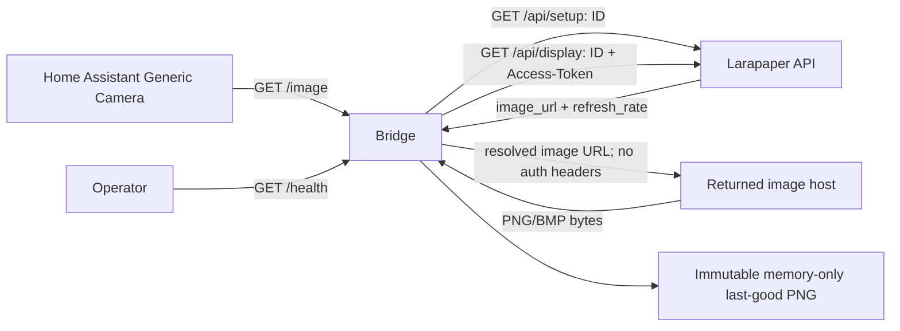

# Home Assistant Bridge — retained architecture

Goal: one stock Home Assistant Generic Camera shows one Larapaper device's current screen as a TRMNL-like display, while Home Assistant refreshes never advance Larapaper's playlist.

## Why a bridge is required

Larapaper requests require custom `ID` and `Access-Token` headers. Home Assistant Generic Camera can send Basic or Digest credentials through Username/Password, but it cannot send those Larapaper headers. Generic Camera also needs image bytes rather than the JSON returned by `/api/setup` and `/api/display`. Display requests update telemetry and advance the playlist, so HA reads must use a cached image and must never call Larapaper. Larapaper may return BMP while Generic Camera accepts PNG, JPEG, GIF, SVG, or WebP. A small Bun bridge therefore owns authentication, device-cadence polling, image normalization, and a memory-only PNG cache; Home Assistant remains stock.

Pinned Larapaper evidence is at commit [`bc114028354d2948fe868f938ed8d41de779b7ac`](https://github.com/usetrmnl/larapaper/tree/bc114028354d2948fe868f938ed8d41de779b7ac):

- [`SetupController.php`](https://github.com/usetrmnl/larapaper/blob/bc114028354d2948fe868f938ed8d41de779b7ac/app/Http/Controllers/Api/Firmware/SetupController.php)
- [`ResolveDeviceByMacAddress.php`](https://github.com/usetrmnl/larapaper/blob/bc114028354d2948fe868f938ed8d41de779b7ac/app/Actions/Api/ResolveDeviceByMacAddress.php)
- [`DisplayController.php`](https://github.com/usetrmnl/larapaper/blob/bc114028354d2948fe868f938ed8d41de779b7ac/app/Http/Controllers/Api/Firmware/DisplayController.php)
- [`RunDeviceDisplayCycle.php`](https://github.com/usetrmnl/larapaper/blob/bc114028354d2948fe868f938ed8d41de779b7ac/app/Actions/Api/RunDeviceDisplayCycle.php)
- [`DeviceImageResolver.php`](https://github.com/usetrmnl/larapaper/blob/bc114028354d2948fe868f938ed8d41de779b7ac/app/Services/DeviceImageResolver.php)
- [`config/filesystems.php`](https://github.com/usetrmnl/larapaper/blob/bc114028354d2948fe868f938ed8d41de779b7ac/config/filesystems.php)

Pinned Home Assistant evidence is at commit [`798888125a13838bce8a15b7b5f81fd9738334d5`](https://github.com/home-assistant/core/tree/798888125a13838bce8a15b7b5f81fd9738334d5):

- [`config_flow.py`](https://github.com/home-assistant/core/blob/798888125a13838bce8a15b7b5f81fd9738334d5/homeassistant/components/generic/config_flow.py)
- [`camera.py`](https://github.com/home-assistant/core/blob/798888125a13838bce8a15b7b5f81fd9738334d5/homeassistant/components/generic/camera.py)

Official setup references are [Generic Camera](https://www.home-assistant.io/integrations/generic/), [Picture Entity](https://www.home-assistant.io/dashboards/picture-entity/), and [Picture Glance](https://www.home-assistant.io/dashboards/picture-glance/). There is no linked issue or remote backlog item; exact repository issue search found none.

## Retained architecture and settled operations

Only the bridge calls Larapaper and the returned image host. HA calls only the bridge; HA reads never trigger display, and no bridge, Larapaper, or Basic-auth credentials reach the image host.

One device is in scope. Future implementation targets, intentionally absent until their backlog items land, are `scripts/larapaper-bridge.ts` and `scripts/larapaper-bridge.test.ts`. No internal module layout, package file, container, service unit, or multi-device interface is prescribed. `.task/larapaper-bridge-state.json` is ignored runtime output, never a source input, and must not be pre-created or committed. The bridge creates its parent and file as needed; restart is cold with no disk cache. The operator invariant is one process per state path; v1 has no lock.
Empty-value semantics are settled: an empty required `LARAPAPER_BASE_URL` fails startup. For every defaulted variable, empty or unset uses its documented default: `LARAPAPER_BRIDGE_STATE_FILE` uses `.task/larapaper-bridge-state.json`, `LARAPAPER_BRIDGE_HOST` uses `127.0.0.1`, `LARAPAPER_BRIDGE_PORT` uses `8787`, `LARAPAPER_BRIDGE_MIN_POLL_SECONDS` uses `60`, `LARAPAPER_BRIDGE_MAX_STALE_SECONDS` uses `3600`, and `LARAPAPER_BRIDGE_MAX_IMAGE_BYTES` uses `10485760`; an explicitly custom state path must be a nonempty file path. Empty `LARAPAPER_IMAGE_BASE_URL` and `LARAPAPER_BRIDGE_DEVICE_MAC` mean unset. Basic auth is disabled when both pair values are unset or empty, enabled only when both are nonempty, and exactly one nonempty value fails startup.

Configuration is `LARAPAPER_BASE_URL` (required absolute HTTP(S), allowed pathname prefix, no credentials, query, or fragment), optional `LARAPAPER_IMAGE_BASE_URL` (empty means unset), optional `LARAPAPER_BRIDGE_DEVICE_MAC` (empty means unset), `LARAPAPER_BRIDGE_STATE_FILE` (default `.task/larapaper-bridge-state.json`), `LARAPAPER_BRIDGE_HOST` (default `127.0.0.1`), `LARAPAPER_BRIDGE_PORT` (default `8787`), `LARAPAPER_BRIDGE_MIN_POLL_SECONDS` (default `60`), `LARAPAPER_BRIDGE_MAX_STALE_SECONDS` (default `3600`), `LARAPAPER_BRIDGE_MAX_IMAGE_BYTES` (default `10485760`), and the paired `LARAPAPER_BRIDGE_BASIC_AUTH_USER` / `LARAPAPER_BRIDGE_BASIC_AUTH_PASS`. Normalize one trailing slash on the required base URL, then append `api/setup` or `api/display` without dropping its pathname prefix. The minimum poll is a finite positive number; port is an integer from 1 through 65535; stale seconds and maximum image bytes are positive integers. Empty optional values are unset. Basic auth is disabled when both auth values are unset or empty, enabled only when both are nonempty, and a configuration with exactly one nonempty value fails startup; blank template entries are therefore valid.

The canonical configured MAC is exactly six colon-delimited hexadecimal octets, normalized to uppercase. A generated MAC uses a CSPRNG and has the locally administered and unicast bits set. State v1 is the exact union `{version:1,mac}` or `{version:1,mac,api_key,friendly_id}`. Persist pending state atomically before setup and complete state atomically after setup; create the parent, use mode `0600`, and use a same-directory temporary file plus rename. Reuse complete state and skip setup. Exact-shape, unsupported-version, malformed, credential-only, group/world-permission, and environment/state-mismatch failures fail closed before network access; a group/world-permission failure reports chmod-600 remediation. Never delete state or silently reprovision. The one-process-per-state-path rule is an operator invariant, not an enforced lock.

Setup is `GET /api/setup` with `ID` only, no `Access-Token`, no redirects, a 10-second operation timeout, and validated 2xx JSON containing nonempty documented credentials. Existing MAC resolution is idempotent; the setup response does not supply a MAC. Pending setup failures retry at +5, +10, +20, +40, then +60 seconds repeatedly. A setup 404 reports the actionable `assign_new_devices` requirement. Display is `GET /api/display` with `ID` and `Access-Token`, each header sent exactly once per scheduled device cycle. A display failure is side-effect-ambiguous, so there is no fast display retry: the next attempt is after the last valid effective interval or the configured minimum before a first valid response. A display result needs a finite, positive `refresh_rate`; effective interval is `max(server rate, minimum)`. A null or empty `image_url` is recorded as an image error but schedules at that valid effective rate without fetch or image retry. An invalid or missing rate rejects the entire result, preserves the cache, and schedules using the prior effective rate or the configured minimum. There is no 900-second fallback.

Resolve a root-relative image path against the Larapaper base. When `LARAPAPER_IMAGE_BASE_URL` is set, mechanically copy only protocol, hostname, and port from it; preserve the source path and query and ignore the override path and query. Accept trusted HTTP(S) local, external, and S3/CDN URLs; reject credentials, fragments, non-HTTP(S), HTML, and unknown bytes. Follow at most three HTTP(S) redirects because trusted S3/CDN is in scope, revalidate every destination, enable TLS validation, and never send bridge, Larapaper, or Basic-auth headers to an image host. For Content-Type, missing or `application/octet-stream` may use magic bytes; declared `image/png` or `image/bmp` must match magic bytes; every other declared type fails. Enforce the maximum size on fetched input and converted output using early Content-Length and streamed byte counts. A valid PNG passes through; BMP converts through ImageMagick argv without a shell; published output is always valid `image/png`. Probe `magick`, then `convert`, at startup. `filename` and `special_function` are untrusted unused metadata.

Image or conversion failures retry only the captured resolved URL at +5, +10, +20, +40, then +60 seconds repeatedly; a retry due at or after the next display deadline is skipped and that URL is abandoned. Never recall display and keep one in-flight operation. Cache only an immutable last-good PNG and timestamp in memory. At age equal to maximum stale, the cache is stale and `/image` returns `503`; `/health` is the freshness authority even though HA may retain its own image indefinitely. There is no disk image cache.
At each next display deadline, abort and abandon any in-flight old image fetch, conversion, or retry before making the single new display call; no old image operation may overlap that call.
Health failure semantics are settled: `last_error` is exactly one fixed allowlisted safe code selected by failure category; the code-only allowlist is `setup_auto_assign_disabled`, `setup_failed`, `display_failed`, `invalid_display_response`, `image_url_missing`, `image_fetch_failed`, `image_validation_failed`, `image_conversion_failed`, or `internal_error`. A setup 404 maps to `setup_auto_assign_disabled`; other failures map to their category code. It never contains a raw exception, response body, URL, query, header text, credential, or converter stderr. It is the most recent failure since the last successful image and clears when a successful cache replacement occurs. A fresh cache may therefore yield status `ready` with nonnull `last_error`. Every `/health` response is `application/json` with `Cache-Control: no-store`.

Health JSON is exactly `{"status":"ready|starting|stale|error","ready":boolean,"stale":boolean,"last_success_at":"ISO-8601 UTC"|null,"last_success_age_seconds":nonnegative integer|null,"last_error":"fixed allowlisted safe code"|null,"mime":"image/png"|null,"next_display_at":"ISO-8601 UTC"|null,"next_retry_at":"ISO-8601 UTC"|null}`. Status precedence is `ready` when an image is serveable, otherwise `stale` when an expired cache exists, otherwise `error` when `last_error` is present, otherwise `starting`. Timestamps are ISO-8601 UTC; ages are nonnegative integers; no secrets or URLs appear. `/health` is `200` exactly when status is `ready`, otherwise `503`. Fresh `/image` is `200` with PNG bytes, `Content-Length`, and `Cache-Control: no-store`; cold or stale `/image` is exactly `503` with `Content-Type: application/json`, `Cache-Control: no-store`, and body `{ "error": "image_unavailable" }`.

The listen deadline starts at process launch and is 10 seconds. It does not cancel the one in-flight initial state, provisioning, display, or image attempt; each network or conversion operation has its own 10-second timeout. An invalid configuration, invalid state, or absence of both `magick` and `convert` is fatal before the deadline and before listening. The first successful image may permit listening early; otherwise the bridge listens at the deadline, exposes unavailable state, and continues recovery in the background. Authenticate before routing. When enabled, Basic auth protects both `/image` and `/health`; invalid or missing credentials return `401` JSON `{ "error": "unauthorized" }`, `WWW-Authenticate: Basic realm="larapaper-bridge"`, and `Cache-Control: no-store`; credential comparison is constant-time and secrets are redacted. Unknown paths return `404` JSON `{ "error": "not_found" }`; a non-GET known route returns `405` JSON `{ "error": "method_not_allowed" }` plus `Allow: GET`. All errors are `application/json` and `no-store`. SIGINT and SIGTERM cancel work and timers and close the server. The bridge has no TLS: loopback is the default; remote HA uses a trusted LAN/VPN bind with Basic, or a trusted HTTPS reverse proxy.

## Ordered implementation backlog

### HA-BRIDGE-01 — executable, configuration, and state primitives

**Status / start condition:** Implementation-ready: yes. Available to begin now; no dependencies or blockers.

**Goal / product intent:** Establish validated process inputs and crash-safe identity state so one Larapaper device can be recovered deterministically without reprovisioning or a disk image cache.

**Targets / components:** Future `scripts/larapaper-bridge.ts` and `scripts/larapaper-bridge.test.ts`; configuration parser, MAC identity, state reader/writer, and error boundary. Existing `.gitignore` confirms `.task` is ignored. No package or internal module layout is required.

**Dependencies / order:** None. This is the first item; HA-BRIDGE-02 consumes its validated configuration and state primitives.

**Scope:** Parse `LARAPAPER_BASE_URL`, optional `LARAPAPER_IMAGE_BASE_URL`, optional `LARAPAPER_BRIDGE_DEVICE_MAC`, `LARAPAPER_BRIDGE_STATE_FILE`, `LARAPAPER_BRIDGE_HOST`, `LARAPAPER_BRIDGE_PORT`, `LARAPAPER_BRIDGE_MIN_POLL_SECONDS`, `LARAPAPER_BRIDGE_MAX_STALE_SECONDS`, `LARAPAPER_BRIDGE_MAX_IMAGE_BYTES`, and the paired `LARAPAPER_BRIDGE_BASIC_AUTH_USER` / `LARAPAPER_BRIDGE_BASIC_AUTH_PASS` variables. Treat empty optional image-base URL and MAC values as unset. Require an absolute HTTP(S) base URL that may have a pathname prefix but no credentials, query, or fragment; normalize one trailing slash and preserve that prefix when appending `api/setup` or `api/display`. Enforce defaults `127.0.0.1`, `8787`, `60`, `3600`, and `10485760`; enforce port integer 1–65535, finite positive minimum poll, and positive integer stale and byte limits. Disable auth when both values are unset or empty, enable it only when both are nonempty, and fail startup for exactly one nonempty value. Canonicalize six colon-delimited hexadecimal MAC octets to uppercase or generate a CSPRNG locally administered unicast MAC. Implement exact state union pending `{version:1,mac}` and complete `{version:1,mac,api_key,friendly_id}`. Create the parent, atomically write through a same-directory temporary file plus rename, and enforce mode `0600`.

Empty required `LARAPAPER_BASE_URL` fails startup. Each empty or unset defaulted variable uses its documented default (`LARAPAPER_BRIDGE_STATE_FILE` `.task/larapaper-bridge-state.json`, `LARAPAPER_BRIDGE_HOST` `127.0.0.1`, `LARAPAPER_BRIDGE_PORT` `8787`, `LARAPAPER_BRIDGE_MIN_POLL_SECONDS` `60`, `LARAPAPER_BRIDGE_MAX_STALE_SECONDS` `3600`, and `LARAPAPER_BRIDGE_MAX_IMAGE_BYTES` `10485760`); a custom state path must be a nonempty file path. Empty image-base URL and MAC values are unset, while Basic auth is disabled for two unset/empty values, enabled only for two nonempty values, and fails startup for exactly one nonempty value.
**Non-goals:** Larapaper network calls, provisioning, display, image acquisition, polling, HTTP endpoints, model or playlist assignment, multi-device support, a reprovision CLI, a lock protocol, or any disk image cache.

**Resolved decisions / questions:** Optional blanks are unset so a blank `.env` template is valid, while a one-sided auth pair fails. A base pathname prefix is retained because API paths are appended rather than replacing it. Exact-shape, version, permission, and environment/state mismatch failures are fatal before network access; an existing state with any group/world permissions fails with chmod-600 remediation rather than being silently repaired. Pending state is persisted before setup and complete state after setup; complete state skips setup. State is never auto-deleted or silently reprovisioned, and one process per state path is an operator invariant rather than an enforced lock. These decisions follow the local state contract and the ignored `.task` runtime convention; no product, design, or architecture question remains.

**Acceptance:** Focused tests reject invalid base URL, pathname/credential/query/fragment combinations, port, numeric limits, MAC, one-sided auth, malformed state, unsupported version, credential-only state, permissions, and env/state mismatch before any network attempt. Tests observe all defaults, empty optional values, uppercase and generated MAC bits, parent creation, pending-before-network, complete-state reuse, atomic same-directory replacement, and `0600`. Manual QA confirms `.task/larapaper-bridge-state.json` alone is absent before first run, not the `.task` directory, then confirms the parent and file are created on demand.

Configuration acceptance also covers an empty required base failing, every empty or unset defaulted variable selecting its documented default, an empty state path selecting the default, and a custom state path being rejected unless it is nonempty.

**Verification:** `mise exec bun -- bun test scripts/larapaper-bridge.test.ts`.

**Last known evidence:** The local refinement contract records `Taskfile.dist.yaml`, `example.env`, `mise.toml`, `.gitignore`, and generated `.task` behavior; the Larapaper and Home Assistant pinned links above are the source evidence for downstream contracts. No bridge source exists yet.

**Pending verification before done:** Run the configuration/state boundary and atomic-write tests, then perform the parent/file and permission manual checks described in Acceptance.

**Next action:** Implement the parser, MAC identity, exact state union, and atomic `0600` persistence in the future bridge targets.

### HA-BRIDGE-02 — Larapaper client and crash-safe first-run provisioning

**Status / start condition:** Implementation-ready: yes. Available to begin after HA-BRIDGE-01 is accepted; this is resolved execution order, not an open product/design/architecture question.

**Goal / product intent:** Provision or reuse exactly one synthetic device and obtain side-effect-safe display results without allowing HA reads to advance the Larapaper playlist.

**Targets / components:** Future `scripts/larapaper-bridge.ts` and `scripts/larapaper-bridge.test.ts`; Larapaper setup client, display client, pending/complete state integration, response validation, and retry scheduler.

**Dependencies / order:** HA-BRIDGE-01 must be accepted first so configuration, identity, and state persistence are available; this item precedes image acquisition and polling.

**Scope:** Build the normalized base URL with its pathname prefix. Send `GET /api/setup` with `ID` only and never `Access-Token`; follow no redirects; apply a 10-second operation timeout; accept only 2xx JSON with nonempty documented `api_key` and `friendly_id`. Persist pending state before setup and complete state after successful credentials. Preserve the same MAC through failure and retry. Reuse an existing complete state without setup. Retry setup failures at +5, +10, +20, +40, then +60 seconds repeatedly. Surface a setup 404 as an actionable `assign_new_devices` requirement. Send `GET /api/display` with `ID` and `Access-Token`, exactly once per scheduled device cycle, and represent `image_url` and `refresh_rate`. Require a finite positive rate. A null or empty image URL is an image error but schedules at its valid effective rate without fetching or image retry. An invalid or missing rate rejects the whole display result, preserves the cache, and uses the prior effective rate or configured minimum. A display failure has no fast retry and schedules after the last valid effective interval or the configured minimum before the first valid response.

**Non-goals:** Image download or conversion, image-host authentication, cache implementation, HTTP endpoints, Home Assistant setup, automated model or playlist assignment, a second device, or any HA-triggered display call.

**Resolved decisions / questions:** Setup has no token because the pinned setup controller requires only `ID` and returns documented credentials; MAC resolution is idempotent and the response does not return a MAC. Display sends both custom headers exactly once because the pinned display controller performs telemetry and the device display cycle on every accepted request. Side-effect ambiguity forbids a fast display retry. A valid rate is finite and positive, and the effective interval is `max(server rate, minimum)` with no integer-only rule, upper clamp, or 900-second fallback. The null/empty image case records an image error but does not fetch or retry; an invalid rate rejects the result. No product, design, or architecture question remains.

**Acceptance:** Fixtures observe pending state before the first setup request, no setup token, exact `ID`-only setup headers, exact display headers once each, no redirects, timeouts, 2xx and credential validation, complete-state reuse, idempotent MAC behavior, actionable `assign_new_devices` 404 text, and setup retry timing. Fixtures cover valid, null/empty-image, invalid-rate, and failed-display responses, including cache preservation and next-cycle scheduling. Manual QA with a user lacking `assign_new_devices` confirms the actionable failure and no automated model/playlist assignment.

**Verification:** `mise exec bun -- bun test scripts/larapaper-bridge.test.ts`.

**Last known evidence:** The pinned `SetupController.php`, `ResolveDeviceByMacAddress.php`, `DisplayController.php`, and `RunDeviceDisplayCycle.php` links above establish the request headers, returned credentials, idempotency, telemetry side effect, and display payload. The local contract fixes the retry and invalid-result semantics.

**Pending verification before done:** Run deterministic setup/display fixtures and the missing-permission manual scenario; verify credentials and auth headers never appear in logs or error strings.

**Next action:** Implement the setup and display clients against the state primitives, then add fake-clock retry and response-validation fixtures.

### HA-BRIDGE-03 — bounded image acquisition and PNG normalization

**Status / start condition:** Implementation-ready: yes. Available to begin after HA-BRIDGE-02 is accepted; this is resolved execution order, not an open product/design/architecture question.

**Goal / product intent:** Turn each accepted display result into one bounded, trusted, valid PNG while isolating image-host requests from Larapaper credentials.

**Targets / components:** Future bridge source/test targets; image URL resolver, bounded HTTP fetcher, redirect validator, byte/content validator, ImageMagick boundary, and PNG/BMP fixtures.

**Dependencies / order:** HA-BRIDGE-01 and HA-BRIDGE-02 must be accepted first; this item consumes the display `image_url` and configured limits and precedes cache publication.

**Scope:** Resolve a root-relative image path against the Larapaper base. When `LARAPAPER_IMAGE_BASE_URL` is set, mechanically copy only protocol, hostname, and port from it; preserve the source path and query and ignore the override path and query. Accept trusted HTTP(S) local, external, and S3/CDN URLs; reject credentials, fragments, non-HTTP(S), HTML, and unknown bytes. Follow at most three HTTP(S) redirects because trusted S3/CDN is in scope, revalidate every destination, enable TLS validation, and never send bridge, Larapaper, or Basic-auth headers to an image host. For Content-Type, missing or `application/octet-stream` may use magic bytes; declared `image/png` or `image/bmp` must match magic bytes; every other declared type fails. Enforce the maximum size on fetched input and converted output using early Content-Length and streamed byte counts. A valid PNG passes through; BMP converts through ImageMagick argv without a shell; published output is always valid `image/png`. Each image network or conversion operation has its own separate 10-second timeout. At startup, probe `magick` first and select it when present; when `magick` is absent and `convert` is present, select `convert`; a single missing executable is not fatal; when both are absent, fail startup before listening. Ignore `filename` and `special_function`; they are untrusted unused metadata. Keep acquisition and conversion memory-only and produce no disk output.

**Non-goals:** Poll scheduling, display recall, retry policy, memory cache, HTTP endpoints, disk output, HTML fallback, arbitrary image formats, or credential forwarding to an image host.

**Resolved decisions / questions:** The pinned `config/filesystems.php` establishes local/S3 URL construction, while `DeviceImageResolver.php` establishes image path forms; together they prove that Larapaper can return local, external, or S3/CDN filesystem URLs, so cross-origin HTTP(S) redirects up to three are allowed but every destination is independently validated. Magic bytes are authoritative only for missing or octet-stream declarations; declared PNG/BMP types must agree and all other declarations fail. PNG pass-through avoids unnecessary conversion; BMP conversion is the only required conversion and uses argv/no shell. Input and output limits both apply because conversion can expand bytes. No product, design, or architecture question remains.

**Acceptance:** Fixtures cover root-relative resolution, base pathname retention, override origin-only behavior, source path/query preservation, ignored override path/query, local/external/S3/CDN redirects, three-redirect limit, destination revalidation, TLS validation, absence of Larapaper and Basic headers, credentials/fragments/non-HTTP(S), missing/octet-stream magic handling, PNG/BMP conflicts, HTML/unknown bytes, early and streamed input limits, converted output limits, PNG pass-through, BMP PNG output, and timeout behavior. Manual QA with `magick` present confirms `magick` is selected; with `magick` absent and `convert` present confirms `convert` is selected; with both absent confirms fatal diagnostics before listening.

**Verification:** `mise exec bun -- bun test scripts/larapaper-bridge.test.ts`.

**Last known evidence:** The pinned `config/filesystems.php` establishes local/S3 URL construction, while `DeviceImageResolver.php` establishes image path forms and the pinned Larapaper display source establishes the returned metadata. The local image contract establishes trusted redirects, auth isolation, exact Content-Type handling, limits, and startup probing.

**Pending verification before done:** Run the bounded fetch/conversion fixtures and converter-selection startup checks for magick-present, magick-absent/convert-present, and both-absent cases, including assertions that no disk output or secret header is produced.

**Next action:** Implement URL resolution, isolated bounded fetching, exact byte/type checks, and the ImageMagick argv adapter.

### HA-BRIDGE-04 — device-cadence polling and memory cache resilience

**Status / start condition:** Implementation-ready: yes. Available to begin after HA-BRIDGE-03 is accepted; this is resolved execution order, not an open product/design/architecture question.

**Goal / product intent:** Poll one device at its own cadence, retain the last safe screen in memory, and recover from failures without HA-induced playlist advancement.

**Targets / components:** Future bridge source/test targets; one-device scheduler, display-cycle coordinator, image retry controller, immutable in-memory cache, stale computation, and shutdown cancellation.

**Dependencies / order:** HA-BRIDGE-01 through HA-BRIDGE-03 must be accepted first; this item composes their validated state, display result, image fetch, and PNG output.

**Scope:** Make exactly one display call at each scheduled device cycle. For a valid finite positive `refresh_rate`, use `max(refresh_rate, configured minimum)`. A null or empty `image_url` records an image error, preserves the immutable cache, and schedules by the valid effective interval without fetch or image retry. Reject a result with an invalid or missing rate, preserve the cache, and use the prior effective interval or configured minimum. Never fast-retry a display failure. After a successful display, retry only its captured resolved image URL at +5, +10, +20, +40, then +60 seconds repeatedly; skip any retry due at or after the next display deadline and abandon that URL. Never recall display for image recovery and never run more than one operation in flight. Store only an immutable last-good PNG and timestamp in memory. Treat age equal to `LARAPAPER_BRIDGE_MAX_STALE_SECONDS` as stale; expose stale and make `/image` unavailable at that boundary. Supply freshness, next-display, next-retry, error, and cancellation data to health. Cancel timers and in-flight work on SIGINT/SIGTERM. HA reads only `/image` and therefore never trigger display.

At the next display deadline, abort and abandon any in-flight old image fetch, conversion, or retry before starting the single new display call; retry delays are successive delays after each failure and never cross that deadline.
**Non-goals:** HTTP routing or authentication implementation, disk cache, disk image output, multi-device scheduling, per-plugin aliases, a 900-second fallback, display recall, or any HA-triggered display call.

**Resolved decisions / questions:** Larapaper's pinned display action has side effects on every accepted display request, so device cadence is the only display schedule and image retries use the captured URL. The +5, +10, +20, +40, +60 pattern repeats only before the next display deadline, preventing stale URL recovery from shifting device cadence. An immutable memory-only cache protects the last valid screen; restart is cold and has no disk cache. The exact stale boundary makes `/health` authoritative even when HA retains its own image indefinitely. No product, design, or architecture question remains.

**Acceptance:** Fake-clock tests prove one display call per cycle, effective-rate clamping only to the configured minimum, null/empty-image scheduling without fetch, invalid-rate rejection, display-failure scheduling, immutable cache bytes and timestamp, captured-URL retry timing, deadline skip and URL abandonment, abort of in-flight old image work before the single new display call, one in-flight operation, exact stale boundary, health timing fields, and SIGINT/SIGTERM cancellation. Manual QA repeatedly refreshes the HA camera and observes that Larapaper telemetry and playlist advance only on bridge cadence, not on reads.

**Verification:** `mise exec bun -- bun test scripts/larapaper-bridge.test.ts`.

**Last known evidence:** The pinned `DisplayController.php` and `RunDeviceDisplayCycle.php` establish display side effects; the local resilience contract establishes cadence, retry, stale, memory-only, and HA-read behavior.

**Pending verification before done:** Run fake-clock scheduler/cache tests and the repeated-refresh manual scenario, including the exact equal-to-max-stale boundary.

**Next action:** Implement the single-cycle scheduler, captured-URL retry controller, immutable memory cache, health timing state, and cancellation path.

### HA-BRIDGE-05 — authenticated image/health HTTP service

**Status / start condition:** Implementation-ready: yes. Available to begin after HA-BRIDGE-04 is accepted; this is resolved execution order, not an open product/design/architecture question.

**Goal / product intent:** Serve stock Generic Camera image bytes and an exact operator freshness contract through a safe, authenticated local HTTP service.

**Targets / components:** Future bridge source/test targets; listener, route dispatcher, pre-routing Basic-auth middleware, exact JSON/error responses, health projection, and graceful shutdown.

**Dependencies / order:** HA-BRIDGE-01 through HA-BRIDGE-04 must be accepted first; this item exposes their cache, health, startup, and configuration state.

**Scope:** Start the 10-second listen deadline at process launch without cancelling the one in-flight initial state, provisioning, display, or image attempt. Give each network and conversion operation its own 10-second timeout. Fail before the deadline and before listening for invalid configuration, invalid state, or absence of both `magick` and `convert`. Listen early after the first successful image when possible; otherwise listen at the deadline, expose unavailable state, and recover in the background. Authenticate before routing; when Basic auth is enabled, protect both `/image` and `/health`, compare credentials in constant time, redact secrets, and return invalid or missing credentials as `401` with `Content-Type: application/json`, `Cache-Control: no-store`, body `{ "error": "unauthorized" }`, and `WWW-Authenticate: Basic realm="larapaper-bridge"`. Implement `GET /health` with the exact health schema and status precedence; return `200` only for `ready`, otherwise `503`. Implement `GET /image` as fresh `200` `image/png` with `Content-Length` and `Cache-Control: no-store`; cold or stale returns exactly `503` JSON `{ "error": "image_unavailable" }`. Unknown paths return `404` JSON `{ "error": "not_found" }`. Non-GET requests to known routes return `405` JSON `{ "error": "method_not_allowed" }` plus `Allow: GET`. Every error response is `application/json` and `no-store`. SIGINT and SIGTERM cancel work and timers and close the server.

Health keeps `last_error` as exactly one fixed allowlisted safe code selected by failure category; the code-only allowlist is `setup_auto_assign_disabled`, `setup_failed`, `display_failed`, `invalid_display_response`, `image_url_missing`, `image_fetch_failed`, `image_validation_failed`, `image_conversion_failed`, or `internal_error`. A setup 404 maps to `setup_auto_assign_disabled`; other failures map to their category code. It never contains a raw exception, response body, URL, query, header text, credential, or converter stderr. It records the most recent failure since the last successful image and clears it on successful cache replacement; a fresh cache may be `ready` with nonnull `last_error`, and every `/health` response is `application/json` with `Cache-Control: no-store`.

**Non-goals:** TLS termination, reverse-proxy implementation, packaging, container or service unit, dashboard creation, alternate image formats, or an endpoint that calls Larapaper display.

**Resolved decisions / questions:** Authentication precedes routing so an enabled service does not disclose whether a path exists; the challenge realm is exact and all auth failures are no-store JSON. Health status is `ready` only when the in-memory image is serveable, with `stale`, `error`, and `starting` precedence as defined globally; status is the freshness authority rather than HA's indefinite fallback. The pinned HA Generic Camera implementation supports image bytes, a still-fetch timeout, and Basic/Digest fields, which makes these two stock endpoints sufficient. The bridge has no TLS and defaults to loopback; remote HA requires a trusted LAN/VPN bind with Basic or a trusted HTTPS reverse proxy. No product, design, or architecture question remains.

**Acceptance:** Tests assert the exact health keys, values, schema, timestamps, status precedence, `last_error` persistence and clear-on-success behavior, fresh-ready with nonnull `last_error`, the fixed allowlist and category mapping including `setup_auto_assign_disabled` for setup 404, all `/health` `application/json` and `no-store` headers, `200`/`503` mapping, fresh image headers and bytes, exact unavailable body, auth-before-routing behavior, challenge, no-store JSON errors, exact 404 and 405 bodies, `Allow: GET`, startup deadline and per-operation timeout behavior, early-listen path, background recovery, and signal cleanup. Tests cover redaction by injecting raw exception, response body, URL, query, header text, credential, and converter stderr into each failure category and asserting that `last_error` is exactly that category's fixed allowlisted safe code and contains none of those inputs. Manual QA uses `curl -i http://127.0.0.1:8787/health` and `curl -i http://127.0.0.1:8787/image` across cold, fresh, and stale states, then repeats with `-u user:pass` when auth is enabled.

**Verification:** `mise exec bun -- bun test scripts/larapaper-bridge.test.ts`.

**Last known evidence:** The pinned Home Assistant `config_flow.py` and `camera.py` links establish Generic Camera image/auth behavior; the local HTTP contract establishes exact schema, bodies, headers, startup, and shutdown behavior.

**Pending verification before done:** Run endpoint/status/auth/startup tests and the focused curl matrix against cold, fresh, stale, unknown-path, unsupported-method, and enabled-auth cases.

**Next action:** Implement pre-routing authentication, exact `/health` and `/image` routes, JSON error helpers, and graceful listener shutdown.

### HA-BRIDGE-06 — operator launch and Home Assistant setup

**Status / start condition:** Implementation-ready: yes. Available to begin after HA-BRIDGE-05 is accepted; this is resolved execution order, not an open product/design/architecture question.

**Goal / product intent:** Make a cold-start launch and stock Home Assistant setup deterministic from one configured Larapaper device to a working camera card.

**Targets / components:** `Taskfile.dist.yaml`, `example.env`, existing `README.md`, and future `scripts/larapaper-bridge.ts` and `scripts/larapaper-bridge.test.ts`; no new planning markdown.

**Dependencies / order:** HA-BRIDGE-01 through HA-BRIDGE-05 must be accepted first; this is the integration and operator procedure item.

**Scope:** Add the launch task named `larapaper:bridge:run`, with Taskfile dotenv supplying `.env`; document the exact launch `mise exec task -- task larapaper:bridge:run`, direct diagnostic `mise exec bun -- bun run scripts/larapaper-bridge.ts`, the current test command, and required Bun plus ImageMagick mise tools. Document blank optional template values, runtime-only ignored `.task/larapaper-bridge-state.json`, cold restart, and the one-device invariant. Have the operator enable Larapaper `assign_new_devices`, start the bridge, manually assign the model and playlist, and wait for `/health` to become healthy. Configure Generic Camera Still Image URL as `http://<bridge-host>:8787/image`; leave Stream Source blank; choose Authentication Basic with Username and Password only when bridge auth is enabled; set Verify SSL false for direct `http://` and true for a trusted HTTPS reverse proxy. After a healthy preview, add either Picture Entity `{type: picture-entity, entity: camera.<name>}` or Picture Glance `{type: picture-glance, camera_image: camera.<name>, entities: []}`. State the network direction explicitly: the bridge reaches Larapaper and the returned image host; HA reaches the bridge. HA never reaches Larapaper and HA reads never trigger display. For remote HA, use a trusted LAN/VPN bind with Basic over HTTP or a trusted HTTPS reverse proxy.

The Generic Camera fields are Still Image URL `http://<bridge-host>:8787/image`, Stream Source blank, Authentication=Basic with Username/Password only when bridge auth is enabled, and Verify SSL false for direct `http://` or true for a trusted HTTPS proxy.

**Non-goals:** Container, package, or service-unit layout; TLS implementation in the bridge; remote issue/project updates; multi-device setup; per-plugin on-demand aliases; disk cache; automated model or playlist assignment; or a new planning markdown file.

**Resolved decisions / questions:** The exact task name and command are fixed so Taskfile invocation and direct diagnostics cannot diverge; Taskfile dotenv supplies `.env`. Generic Camera uses only the bridge Still Image URL and no Stream Source because the bridge publishes a still image, while Basic fields are conditional on enabled bridge auth. Verify SSL follows transport: false for direct HTTP and true for a trusted HTTPS proxy. Picture Entity and Picture Glance are both supported after preview, with the exact configurations above and official links in the evidence section. The pinned repository evidence shows Bun/ImageMagick as mise tools, ignored `.env` and `.task`, and existing README/Taskfile conventions. No product, design, or architecture question remains.

**Acceptance:** Starting from a blank optional template, the operator enables `assign_new_devices`, runs `mise exec task -- task larapaper:bridge:run`, assigns model and playlist manually, waits for healthy `/health`, and previews `http://<bridge-host>:8787/image` in Generic Camera with Stream Source blank and the correct auth/SSL fields. The operator adds and renders either the exact Picture Entity or Picture Glance configuration. The bridge host is reachable from HA, the bridge reaches Larapaper and the image host, state remains ignored runtime output, and repeated HA refreshes do not advance the playlist.

**Verification:** `mise exec bun -- bun test scripts/larapaper-bridge.test.ts`; `mise exec bun -- bun run scripts/larapaper-bridge.ts`; `mise exec task -- task --list`; then focused curl QA against `/health`, `/image`, an unknown path, an unsupported method, and Basic auth from the HA network.

**Last known evidence:** The local refinement contract records `Taskfile.dist.yaml`, `example.env`, `mise.toml`, `.gitignore`, `.taskfiles/setup.yaml`, `README.md`, and existing image-preparation tooling. Official Generic Camera, Picture Entity, and Picture Glance links establish the stock HA fields and card forms. There is no linked issue or remote backlog item; exact repository issue search found none.

**Pending verification before done:** Implement the Taskfile, env-template, and README integration, then run the exact launch/list/curl checks and the local-to-HA preview, card, auth, SSL, state, and repeated-refresh scenarios.

**Next action:** Add the launch task and documented variables to existing integration files when implementation reaches this item, then execute the complete operator path without adding a package, container, service unit, or planning file.
